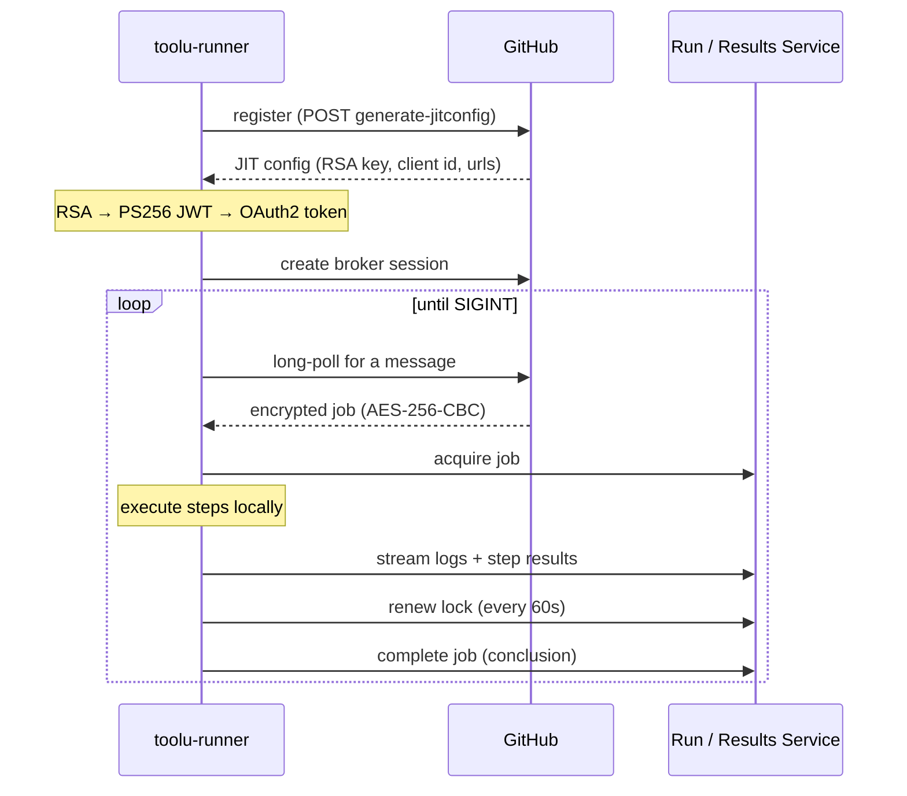

<div align="center">

# toolu-runner

**A self-hosted GitHub Actions runner, rewritten in Rust.**

One static binary. No .NET. No orchestrator service. No daemon you
didn't ask for.

[](https://github.com/Falconiere/toolu-ghrunner/actions/workflows/ci.yml)
[](https://github.com/Falconiere/toolu-ghrunner/actions/workflows/live.yml)
[](rust-toolchain.toml)
[](LICENSE)

[Install](#install) · [Quick start](#quick-start) ·
[Watch a job](#watch-live-jobs-in-your-terminal) ·
[How it works](#how-it-works) ·
[Cache acceleration](#cache-acceleration) ·
[vs. `actions/runner`](#vs-actionsrunner) ·
[Docs](docs/architecture.md)

</div>

---

`toolu-runner` speaks the same JIT listener protocol as GitHub's own
runner — RSA key reconstruction → PS256 JWT → OAuth2 → broker session →
long-poll → execute → report. It runs your real workflows: shell steps,
Node.js actions, Docker actions, composite actions, reusable workflows,
matrices, `${{ }}` expressions, artifacts, cache, and OIDC.

The nightly [`live`](.github/workflows/live.yml) workflow above is not a
mock. It dispatches a real job to a real `toolu-runner` on a real repo,
every morning at 06:00 UTC.

> [!WARNING]
> **Pre-alpha (v0.1.0).** The live path is green nightly, but rough
> edges remain: `remove` doesn't yet call GitHub's unregister API, and
> there is no watchdog for network outages lasting more than 5 minutes
> mid-job. See [docs/known-bugs.md](docs/known-bugs.md) before you point
> this at anything you care about.

## Install

```sh
# macOS / Linux — installs to /usr/local/bin
curl -fsSL https://raw.githubusercontent.com/Falconiere/toolu-ghrunner/main/install.sh | sh

# ...or Homebrew
brew install falconiere/tap/toolu-runner
```

Add `--service` to also install and start the service unit (launchd on
macOS, systemd on Linux). Pass `--check` to print the plan and exit
without downloading anything.

Prebuilt for **macOS** (arm64, x86_64) and **Linux** (x86_64, arm64).

## Quick start

```sh
# 1. Register — the repo is inferred from the cwd git remote `origin`
cd my-repo && toolu-runner register

# 2. Run the listener — executes one job, then exits
toolu-runner run

# 3. Watch jobs execute, in another terminal
toolu-runner watch
```

No flags, no PAT to craft by hand: on an interactive terminal with no
token available, `register` runs GitHub's OAuth **device flow inline** —
enter a one-time code in your browser, and the minted token lands in
your OS keyring (0600 file fallback where no keyring exists). One login
per host covers every repo: the token store is shared, at the
runner-home root. Until the built-in OAuth App ships, the device flow
needs your own App's client id — set `TOOLU_RUNNER_CLIENT_ID`, or run
`toolu-runner login --client-id <id>` once.

Each registration gets its own directory —
`~/.toolu-runner/runners/<owner>/<repo>/` (config, credentials, lock,
logs) — so one machine holds runners for many repos, and jobs for
*different* repos run **concurrently**: the single-job lock is per repo.

### Headless / GHES

Everything can also be explicit — for scripts, org-level runners, and
GitHub Enterprise:

```sh
# explicit repo or org URL (org runners always need --url)
toolu-runner register --url https://github.com/owner/repo

# explicit credential: a PAT or App installation token with
# administration:write on the repo/org — flag or env
toolu-runner register --url https://github.com/owner/repo --token <pat>
TOOLU_RUNNER_TOKEN=<pat> toolu-runner register

# GHES: register an OAuth App on the instance, log in against it,
# then register with an explicit --url (inference is github.com-only)
toolu-runner login ghes.example.com --client-id <id>
toolu-runner register --url https://ghes.example.com/owner/repo
```

Bearer resolution for `register`: `--token` > `TOOLU_RUNNER_TOKEN` >
stored `login` token > inline device flow (interactive terminals only —
non-interactive runs fail, listing those three options).

`login` / `logout` manage the stored token per host — they take a
hostname, not `--config`. `status` prints local state — including login
— without touching the network. `remove` unregisters. That's the whole
CLI.

### CLI flags reference

| Flag | Command | What it does |
|---|---|---|
| `--work <DIR>` | `register` | Job workspace directory (default `~/.toolu-runner/_work`). |
| `--runner-group <ID>` | `register` | Numeric runner group ID for org registrations. Group *names* aren't supported by the JIT API — a non-numeric value warns and falls back to the Default group. |
| `--replace` | `register` | Overwrite an existing registration with the same name. |
| `--once` | `run` | Exit after the first job — currently the default behavior, since a JIT registration is single-use. |
| `--force` | `remove` | Cancel an in-flight run before unregistering. |
| `--client-id <ID>` | `login` | OAuth App client id for the device flow (fallback: `TOOLU_RUNNER_CLIENT_ID`). Needed until the built-in github.com App ships; always needed for GHES. |

`register`, `run`, `remove`, `status`, and `watch` also take
`--config <FILE>`; when omitted, the config resolves to the cwd-inferred
`runners/<owner>/<repo>/config.toml` under the runner home, else the
sole existing registration. Every command documents itself in full:
`toolu-runner <command> --help`.

## Watch live jobs in your terminal

Every job writes a JSONL event journal to disk. `toolu-runner watch` is a
TUI over that journal — job history, a live step tree, streaming logs,
and a cancel key. No network, no server, no browser tab.

```
┌ toolu-runner watch ─────────────────────────────────────────────────────┐
│ runner: my-runner │ running · pid 48213 │                               │
└─────────────────────────────────────────────────────────────────────────┘
┌ jobs ──────────────────────────┐┌ build — running ───────────────────────┐
│ ● build          10:42:07      ││ ✓  1. Set up job                       │
│ ✓ test           09:18:22      ││ ✓  2. Checkout                         │
│ ✗ lint           08:55:01      ││ ●  3. cargo build --release            │
│ ⊘ deploy         08:31:44      ││ ○  4. Upload artifact                  │
│ ○ nightly        06:00:12      │└────────────────────────────────────────┘
│                                │┌ logs (follow) ─────────────────────────┐
│                                ││    Compiling protocol v0.1.0           │
│                                ││    Compiling toolu-runner v0.1.0       │
│                                ││     Finished `release` in 41.20s       │
└────────────────────────────────┘└────────────────────────────────────────┘
 q quit │ Tab pane │ ↑↓/jk move │ Enter open │ f follow │ PgUp/PgDn scroll │ c cancel
```

Logs are masked through the same `SecretMasker` that guards the runner's
own log file, so `secrets.*` values never land on disk in the clear.
`watch` also works with no runner running — it browses the job journals
of every registration (`runners/<owner>/<repo>/_diag/jobs/` plus the
legacy home), merged, newest first (each dir keeps its newest 50).

## How it works



One process, one job per registration. The single-job guarantee is an
`fs2` file lock on the registration's own `.lock` (under
`~/.toolu-runner/runners/<owner>/<repo>/`) whose body carries the
holder's PID — a second `run` for the same repo reads it, prints the
PID, and exits `2`. Stale locks (dead PID, mtime > 5 min) are reclaimed
automatically. Different repos lock independently, so cross-repo jobs
run concurrently on one machine. (In `offline` / `accelerated` service
modes, give each repo's config a distinct `service_bind` — concurrent
runs would otherwise collide on the port; the default `forwarder` mode
binds nothing.)

`SIGINT`/`SIGTERM` are bridged to a `CancellationToken` that the poll
loop, the renewal task, and the in-flight job all observe. Nothing is
left orphaned.

### What runs

| | |
|---|---|
| **Steps** | `run:` shell, `uses:` Node.js actions (runtime auto-downloaded + cached), Docker actions, composite actions, plugins |
| **Workflows** | matrices, `needs:` job graphs, reusable workflows, `if:` conditions, `timeout-minutes`, `working-directory`, `defaults.run` |
| **Expressions** | the full `${{ }}` engine — lexer, parser, evaluator, `hashFiles`, `fromJSON`/`toJSON`, `contains`, `startsWith`, … |
| **Services** | artifacts, cache, and OIDC — forwarded to real GitHub by default, hosted locally in `offline` mode, or a local content-addressed cache accelerator in `accelerated` mode |
| **Safety** | secret masking across logs, stdout, and the journal; strict-mode clippy (no `unwrap`, no `panic`, no `unsafe`) |

### Service modes

`[services] mode` decides where artifacts, cache, and OIDC go.

- **`forwarder`** (default) — the runner reads the real GitHub service
  URLs and runtime token out of the job message and injects them into
  step env, so stock `upload-artifact@v4` / `cache@v4` / OIDC talk
  straight to GitHub. Drop-in compatible.
- **`offline`** — the runner hosts local stand-ins for those services.
  For airgapped hosts.
- **`accelerated`** — a local content-addressed cache intercepts
  GitHub Actions cache traffic (both the v2 Twirp `CacheService` and
  the legacy v1 REST protocol) and serves it from local NVMe,
  reverse-proxying everything else — artifacts included — to real
  GitHub. See [Cache acceleration](#cache-acceleration).

## Cache acceleration

In `accelerated` mode the runner hosts its own GitHub Actions cache. It
stores content-addressed, FastCDC-chunked blobs on local disk and
overrides **both** `ACTIONS_RESULTS_URL` (v2 Twirp) and
`ACTIONS_CACHE_URL` (legacy v1 REST) so that `actions/cache@v4`,
`docker buildx`'s `type=gha`, and older v1-only cache clients all hit
the local store instead of Azure. Everything that isn't cache — most
importantly `upload-artifact@v4` / `download-artifact@v4` — is
reverse-proxied verbatim to the real service, and `ACTIONS_RUNTIME_TOKEN`
stays the real GitHub token. Reads are shared across branches (chunks
are content-verified on every read); writes are branch-scoped, so a
`pull_request` job cannot poison a protected branch's cache. An
optional S3 cold tier (`[cache.l2]`) mirrors immutable chunks and
manifests off-box.

```toml
[services]
mode = "accelerated"     # "forwarder" (default) | "offline" | "accelerated"
bind = "0.0.0.0"         # must not be loopback — docker-container BuildKit reaches it here

[cache]
max_bytes          = 107374182400   # 100 GiB local (L1) budget
entry_ttl_days     = 7              # matches GitHub
protected_branches = ["main", "master"]
chunk_avg_bytes    = 65536          # FastCDC target chunk size

[cache.l2]                          # optional S3 cold tier
enabled  = false
bucket   = ""
endpoint = ""
region   = ""

[workspace]
gc_after_hours = 24      # prune _work/<job-id> older than this

[shadow]
enabled = false          # off by default; records would-hit/false-hit, never serves
```

### Docker: `buildx` needs `--driver-opt network=host`

`docker/build-push-action` and `docker buildx build --cache-to
type=gha` do **not** work against accelerated mode out of the box.
`type=gha` forces the `docker-container` driver, whose BuildKit runs in
its own network namespace and therefore cannot reach the runner's
loopback cache server. Create the builder with host networking so it
can:

```sh
docker buildx create --name toolu --driver-opt network=host --use
docker buildx build \
  --cache-to   type=gha,mode=max,url=http://127.0.0.1:<port>/ \
  --cache-from type=gha,url=http://127.0.0.1:<port>/ \
  .
```

The runner binds `0.0.0.0` (not loopback) precisely so a `network=host`
builder can reach it. This works on **native Linux docker**, where the
host namespace is the machine the runner runs on. On **Docker Desktop**
(macOS/Windows) `network=host` shares the Desktop VM's namespace, not the
host's, so `127.0.0.1` won't reach the runner — use the default bridge and
`--cache-to type=gha,url=http://host.docker.internal:<port>/` instead.

The `token=` attribute must be a **JWT** — BuildKit's cache client parses
it to read its scope claim before making any request, so an opaque string
is rejected. On a real GitHub-hosted job the injected `ACTIONS_RUNTIME_TOKEN`
already is one; only manual `buildx` invocations need to supply a JWT.

## vs. `actions/runner`

GitHub's runner is ~30K lines of C#. `toolu-runner` reimplements the JIT
listener subset in Rust, with a strict `sync protocol` → `async wire`
boundary that keeps the crypto and wire-format code testable without a
clock, a socket, or tokio.

| Subsystem | `actions/runner` | `toolu-runner` |
|---|---|---|
| JIT config parse + RSA + JWT | C# | `protocol::auth` *(sync, no I/O)* |
| Token exchange / session | C# | `wire::net` |
| Message poll loop | C# | `listener::job_lifecycle` |
| Run service (acquire/renew/complete) | C# | `wire::reporting::run_service` |
| Results service (Twirp) | C# | `wire::reporting::results_service` |
| Expression engine (`${{ }}`) | C# | `expressions` *(own crate)* |
| Step handlers | C# | `execution::handlers` |
| Artifacts / OIDC | C# | `execution::{artifacts,oidc}` |
| Content-addressed cache | C# | `cache` *(own crate)* |
| Secret masking | C# | `shared::SecretMasker` + tracing layer |
| Docker | C# | `execution::docker::client` *(bollard)* |
| Node.js auto-download | C# | `execution::node::runtime` |
| Live job TUI | — | **`toolu-runner watch`** *(`observability::watch`)* |
| Plugin system | — | **`execution::plugin::RunnerPlugin`** |

**Deliberately not ported:** OpenTelemetry, and any coupling to the
`yamless` orchestrator this code was extracted from.

**GHES** is supported over the V1 protocol (`connectionData` discovery,
timeline records); protocol version is auto-selected from the `--url`
host at `register` time.

## Configuration

<details>
<summary><code>~/.toolu-runner/runners/&lt;owner&gt;/&lt;repo&gt;/config.toml</code> (mode 0600)</summary>

```toml
runner_url   = "https://github.com/owner/repo"
runner_name  = "my-runner"
runner_id    = 12345
auth_token   = "ghs_..."
labels       = ["self-hosted", "linux", "x64"]
runner_group = "Default"

[runtime]
jit_config       = "<base64 blob from GH>"   # written by `register`
work_dir         = "~/.toolu-runner/_work"
data_dir         = "~/.toolu-runner/runners/owner/repo"
protocol_version = "v2"                      # "v1" for GHES

[services]
mode = "forwarder"   # "forwarder" (default) | "offline" | "accelerated"
```

The `accelerated` mode adds `[cache]`, `[cache.l2]`, `[workspace]`, and
`[shadow]` sections — see [Cache acceleration](#cache-acceleration).

Credentials live beside it in `credentials.json` (also 0600). Don't
hand-edit `jit_config` or `auth_token` — re-run `register --replace`.

</details>

<details>
<summary>Storage layout</summary>

```
~/.toolu-runner/                # runner home — override with $TOOLU_RUNNER_HOME
├── token-<host>.json           # `login` token file fallback (keyring first) — shared by all repos
├── _work/                      # per-job workspaces: <repo>/<job-id>/ (shared default)
├── config.toml                 # legacy single-slot registration; org registrations land here
├── .runner_version
└── runners/<owner>/<repo>/     # one directory per repo registration
    ├── config.toml             # registration + runtime config (0600)
    ├── credentials.json        # (0600)
    ├── .lock                   # per-repo single-job lock (JSON: pid, started_at, config_path)
    ├── .pending_remove         # written by `remove` while a run is in flight
    └── _diag/
        ├── runner.log          # JSON, secret-masked, daily-rotated
        └── jobs/               # per-job JSONL journals (newest 50) — what `watch` reads
```

`remove` deletes a registration's `config.toml`, `credentials.json`,
`.lock`, and `.pending_remove`; `_diag/` is kept, so `watch` history
survives unregistration.

</details>

<details>
<summary>Environment variables</summary>

| Variable | Default | Description |
|---|---|---|
| `TOOLU_RUNNER_HOME` | `~/.toolu-runner` | runner state root: the token store, `runners/<owner>/<repo>/` registrations, default `_work/`. |
| `TOOLU_RUNNER_TOKEN` | — | bearer for `register` (resolution: `--token` > env > stored `login` token). |
| `TOOLU_RUNNER_CLIENT_ID` | — | OAuth App client id for the device flow (`--client-id` fallback). |
| `TOOLU_RUNNER_LOG` | `info` | tracing filter. Checked before `RUST_LOG`. |
| `RUST_LOG` | — | tracing filter (standard fallback). |
| `TOOLU_RUNNER_REPO` | `Falconiere/toolu-ghrunner` | `install.sh` only — release source. |
| `HOME` / `USERPROFILE` | — | resolves `~/.toolu-runner/`. |
| `HOSTNAME` / `COMPUTERNAME` | `unknown` | identifies the runner host at `register`. |
| `YAMLESS_*` | — | **Legacy.** Warned about, then ignored. No compatibility layer. |

`TOOLU_RUNNER_CONFIG` / `_WORK` / `_LABELS` are specced but **not yet
implemented** — use the CLI flags.

</details>

<details>
<summary>Running as a service</summary>

The release tarball ships service files under `scripts/`; `install.sh
--service` installs them.

**launchd (macOS)** — `scripts/io.toolu-runner.plist` →
`~/Library/LaunchAgents/`. Logs to
`/Users/Shared/toolu-runner/_diag/launchd-*.log`.

```sh
launchctl load   ~/Library/LaunchAgents/io.toolu-runner.plist
launchctl unload ~/Library/LaunchAgents/io.toolu-runner.plist
```

**systemd (Linux)** — `scripts/toolu-runner.service` →
`/etc/systemd/system/`. Runs as the `toolu-runner` user with
`NoNewPrivileges`, `ProtectSystem=strict`, `PrivateTmp`, `ProtectHome`,
`MemoryDenyWriteExecute`, and `Restart=always`.

```sh
sudo systemctl daemon-reload
sudo systemctl enable --now toolu-runner
sudo journalctl -u toolu-runner -f
```

</details>

## Troubleshooting

| Symptom | Fix |
|---|---|
| `config not found at ...` / `no runner registration found under ...` | Run `register` before `run`. |
| `several runner registrations found (...)` | More than one repo is registered and the cwd matches none — `cd` into the repo, or pass `--config`. |
| `registration already exists at ...` | Pass `--replace` to `register`. |
| `... is not a git repository` / `has no 'origin' remote` at `register` | Zero-arg inference needs a cwd git repo with an `origin` remote — pass `--url` instead. |
| `no GitHub OAuth App configured` | The built-in device-flow App isn't wired yet — set `TOOLU_RUNNER_CLIENT_ID` (or `login --client-id`), or skip the device flow with `--token` / `TOOLU_RUNNER_TOKEN`. |
| `another run is in flight` | Another `run` holds this repo's `.lock`; its PID is in the error. Wait it out, or cancel with `c` in `watch` (sends SIGINT to the holder). |
| `generate-jitconfig` fails with a network error | A firewall is blocking `api.github.com` (github.com) or the GHES host. |
| `warning: ignoring yamless env var ...` | A stale `YAMLESS_*` var is in your shell rc. Remove it. |

Job not showing up? Check the labels in `runs-on:` match the ones you
registered with, then `toolu-runner watch` to see what the runner
actually received.

## Development

Requires Rust 1.94.1 (pinned in `rust-toolchain.toml`).

```sh
cargo build --workspace
cargo test  --workspace          # 340 tests, no network required

./tools/check.sh all             # the full local gate
```

`tools/check.sh` is stricter than clippy: it rejects `.rs` files over
700 lines, `#[allow(..)]` / `#[expect(..)]` outside tests, `.unwrap()` /
`.expect()` in production code.
`lefthook install` wires the same checks to `pre-commit`.

The live suite talks to a real repo and is token-gated:

```sh
TOOLU_RUNNER_LIVE_TOKEN=<ghs_...> \
  cargo test --workspace --features e2e-live -- --ignored live
```

### Workspace

Ten layered crates under `crates/`, acyclic dependency graph:

- **`protocol`** — JIT config, RSA/JWT, sessions, message decryption.
  Sync, I/O-free, **network-free** (no `reqwest`, no `tokio` — enforced
  by its `Cargo.toml`). No internal deps.
- **`shared`** — config, errors, events, job-message types, tracing
  init, `SecretMasker`, platform labels. Sync, I/O-free. No internal deps.
- **`config`** — registration config (TOML/JSON), the per-repo
  `runners/<owner>/<repo>/` registry, cwd repo inference, the
  single-job file lock, and the login-token store. → `shared`.
- **`expressions`** — the `${{ }}` evaluator. → `shared`.
- **`cache`** — content-addressed CI cache (CAS + Twirp/blob/v1
  endpoints). → `shared`.
- **`wire`** — async HTTP transport (`net/`) + Run/Results reporting
  domain types (`reporting/`). → `shared`, `protocol`.
- **`observability`** — per-job JSONL journal + the `watch` TUI. →
  `shared`, `config`.
- **`execution`** — the job execution engine + Docker/Node/plugin + the
  `Runner`. → `shared`, `expressions`, `cache`.
- **`listener`** — the GitHub JIT lifecycle. → `execution`, `wire`,
  `observability`, `shared`, `protocol`.
- **`toolu-runner`** — the CLI **bin** (`register` / `run` / `remove` /
  `status` / `watch` / `login` / `logout`). → all of the above.

[docs/architecture.md](docs/architecture.md) has the full design with
sequence diagrams for register / run / cancel / reconnect.

## Contributing

PRs welcome. Before you open one:

1. `./tools/check.sh all` passes.
2. `cargo test --workspace` passes.
3. Listener or reporting change? Add a test under `crates/toolu-runner/tests/`.
4. User-facing change? Update `README.md`, `docs/architecture.md`, and
   `CHANGELOG.md` in the same commit.

New files stay under 700 lines; function bodies under 150.

## License

MIT — see [LICENSE](LICENSE).
